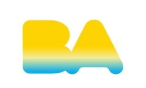
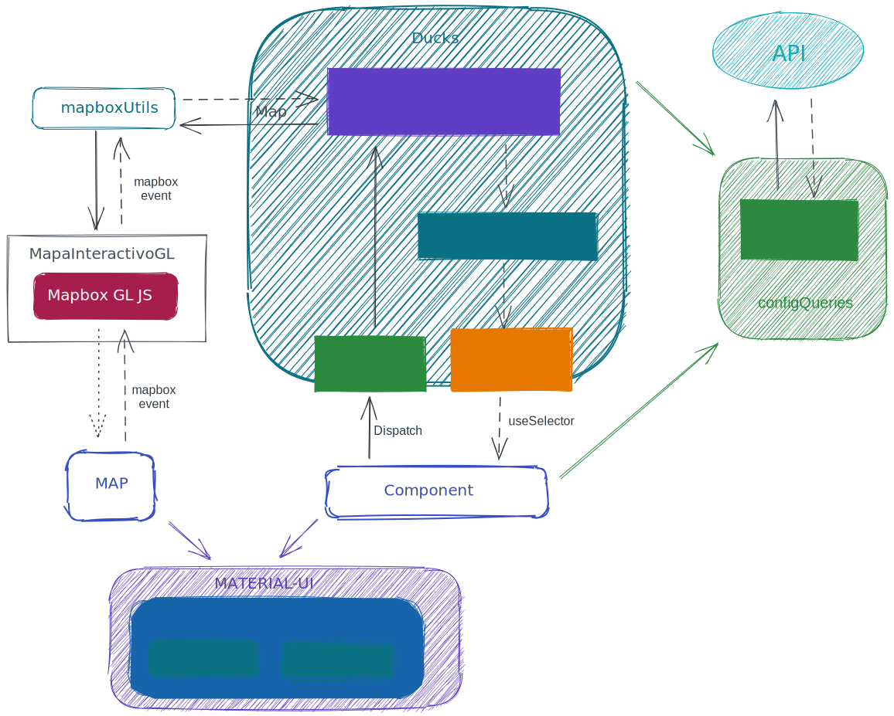

# <p align="center">Ciudad 3D</p>

<p align="center">

</p>

Ciudad 3D es una plataforma para la visualización de información en 3D, a traves de figuras geográficas, del actual Código Urbanístico del Gobierno de la Ciudad de Buenos Aires.

# Indice

- [Ciudad 3D](#ciudad-3d)
  - [Nota del autor:](#nota-del-autor-)
  - [Stack de Tecnológia](#stack-de-tecnológia)
- [Estructura del proyecto](#estructura-del-proyecto)
- [Arquitectura de la Aplicación](#arquitectura-de-la-aplicación)
  - [Librerias](#librerias)
  - [Configuración de la Aplicación](#configuración-de-la-aplicación)
  - [API REST](#api-rest)
- [Ambiente de Desarrollo](#ambiente-de-desarrollo)
  - [Entorno](#entorno)
  - [IDE de desarrollo](#ide-de-desarrollo)
- [Deploy de la Aplicación](#deploy-de-la-aplicación)
  - [Entorno Producción](#entorno-producción)
  - [Utilizando Docker](#utilizando-docker)

### Nota del autor:

Este proyecto depende fuertemente de la clase src/utils/MapaInteractivoGL.js que intenta reemplazar la librería publicada en npm de [mapainteractivo](https://www.npmjs.com/package/@usig-gcba/mapa-interactivo) para lograr la visualización de Vector Tile con diferentes estilos, esto se logra utilizando la libreria de Mapbox-GL-js en su versión 1.0.

Para la siguiente versión se reemplazará la con la libreria [MapLibre-GL-js](https://github.com/maplibre/maplibre-gl-js).

## Stack de Tecnológia

En el actual repositorio se encuentra el desarrollo del Frontend, pero la aplicación cuenta con otros componentes de uso común, siendo los siguientes:

- Frontend

  - React
  - Redux

- Backend - API REST

  - Django
  - Postgres + Postgis

- Server Vector Tile

  - Node.js (Mbtiles)

- Server Raster Tile
  - Servicios OGC

<br>
<br>

# Estructura del proyecto

#### [Volver](#ciudad-3d)

<br>

A continuación especificamos la estructura de carpeta del proyecto. Inicialmente esta dividida en:

- **docs**: contiene la documentación del proyecto adicional al Readme.md
- **source**: contiene el codigo fuente del proyecto

```bash
.
├── docs
│   └── images
└── source
    ├── public
    └── src
        ├── components
        │   ├── Alerts
        │   ├── Categories
        │   ├── FeatureInfo
        │   ├── Logo
        │   ├── Map
        │   ├── Marker
        │   ├── Parcel
        │   ├── Popup
        │   ├── Sections
        │   ├── Seeker
        │   └── SideBar
        ├── containers
        │   └── Home
        ├── img
        ├── state
        │   └── ducks
        ├── theme
        │   ├── FontsTest
        │   └── wrappers
        └── utils
            └── layer-builders


```

### Carpeta Source

- **containers**: Son las páginas, para esta aplicación solo se necesita el container **Home** que sirve de contenedor de los componentes principales **Map**, **SideBar** y **Sections**.

- **components**: Como se dijo en containers hay tres componentes principales que engloban toda la aplicación

  - **Map**: Es un contenedor del mapa generado por mapbox-GL-js a través de **MapaInteractivoGL**, el mini-mapa sirve para cambiar la capa base entre mapa de base o foto aerea 2017

  - **SideBar**: Es un contenedor de **Categories** las cuales se obtienen desde appConfig

  - **Sections**: Cuando una **Category** es seleccionada este componente despliega el
    **Section** correspondiente. A su vez cada **Section** permite navegar entre los **SubSection**

  También existen los siguiente **components**:

  - **Alerts**: Identifica las diferentes alertas de la aplicación, los cambios de estado y estilos

  - **Categories**: Identifica las diferentes categorías, los cambios de estado y estilos

  - **FeatureInfo**: Comunicación con la api de COMO LLEGO para la información de dirección normalizada

  - **Logo**: Imagen de la aplicación

  - **Marker**: Muestra en el mapa las marcas con latitud y longitud (color/estilo)

  - **Parcel**: Visualiza en base a los polígonos/parcelas las capas en el mapa

  - **Popup**: Configuración para ventana emergente (popup)

  - **Seeker**: Es el autocompletado para el buscador, para la calle/altura, lugares, etc.

  Se cuenta con un mayor detalle [aquí](./docs/descripcion_components.md)

- **img**: Almacen de todas las imágenes aplicadas al proyecto (.jpg .png)

- **state**: Aquí se encuentra el estado de la aplicación siguiendo la [guía de estilos redux](https://redux.js.org/style-guide/style-guide) la estructura interna de carpetas y archivos está basada en el [patrón ducks](https://github.com/erikras/ducks-modular-redux), si algún duck se volviera muy complejo tal vez sea recomendable utilizar el patrón [re-ducks](https://github.com/alexnm/re-ducks)

- **theme**: Definiciones sobre los estilos a utilizar, procurando mantener dentro de lo posible los lineamientos de [Material Design](https://material.io/), pero tomando como prioridadla _Identidad de Gobierno de la Ciudad de Buenos Aires_

  - **index.js**: Contiene las modificaciones sobre el tema de estilos material-ui por defecto

  - **Wrappers**: están algunos componentes basados en material-ui para que sean utilizados por los componentes y todos mantengan la estetica

- **utils**: Por supuesto contiene funciones útiles y transversales a las diferentes partes de la aplicación. Entre ellas las más importante son:

  - **MapaInteractivoGL**: Sin lugar a dudas aquí se encuentran partes vitales de la aplicación, desde aquí se puede acceder a mapbox-GL-js que es el corazón de la aplicación

  - **mapBoxUtils**: Principalmente funciones que retornan promesas a ser utilizadas por el middleware. Estas promesas suelen hacer uso de **MapaInteractivoGL** y **Mapbox GL JS**

  - **configQueries**: Sirve para desacoplar los componentes de la configuración de la aplicación

<br>
<br>

# Arquitectura de la Aplicación

#### [Volver](#ciudad-3d)

<br>

## 

## Librerias

Las librerias utilizadas en el proyecto son:

### **EmailJs**

EmailJs es una librería que permite enviar mails desde el frontend con JavaScript. Para este projecto se utiliza con el fin de que los usuarios puedan enviar sus sugerencias y consultas sobre el uso de la aplicación.

La configuración del servicio y el template a utilizar se deben hacer desde [EmailJs](https://dashboard.emailjs.com/admin) accediendo con el usuario especifico. El id del usuario, servicio y el template deben ser colocados dentro del Reducer _contact_ el cuál se encarga de utilizar esta librería. Para más información ver la [guía](https://www.emailjs.com/docs/introduction/how-does-emailjs-work/) de emailJs.

## Sobre la librería **Mapbox GL JS** el componente **Map** y las utilidades **mapboxUtils** y **MapaInteractivoGL**

Como se dijo el corazón de la aplicación es **Mapbox GL JS** esta es una excelente librería para el uso de mapas, lamentablemente está librería está orientada a un paradigma de eventos y objetos donde cada uno mantiene su propia fuente de estado. Mientras por otro lado la aplicación se basa en el principio de redux en mantener una única fuente de datos. Para lograr acoplar estos dos tan diferentes estilos de desarrollo se opta por realizar llamadas a promesas desde el middleware que invoquen los eventos ofrecidos y métodos ofrecidos por mapbox y al terminar el middleware actualizara el estado para que los componentes puedan utilizarlo. Esto se realiza se realiza a través de **mapBoxUtils** y **MapaInteractivoGL**.
Debido a que las nuevas versiones de la libreria no _Open Source_, para futuras versiones se planifica su reemplazo por [MapLibre-GL-js](https://github.com/maplibre/maplibre-gl-js).

## Configuración de la Aplicación

En la variable **REACT_APP_URL_CONFIG** del archivo **.env** se configura una url que obtiene un json entregado por un servicio que contiene toda la información necesaria que la aplicación pueda ser fácilmente adaptada. Se recomienda fuertemente que solo acceda a estas configuraciones a través de configQueries con el objetivo de mantener desacoplado la configuración de los componentes siendo almacenada en memoria o en el sessionStorage según sea conveniente.
En este archivo se configuran los grupos y las capas que figurarán en el panel lateral y las secciones que se abren al seleccionar cada categoría así como también la visualización de sus capas.

## API REST

Para la publicación de información se utiliza una API REST donde se configura en _\source\src\utils\apiConfig.js_

- **API Catastro**: retorna la información de referecia de la Parcela y su SMP
- **API Ciudad 3D**: provee la información relacionada a las secciones del panel lateral de información sobre la Parcela, como también los calculos de la pusvalia
- **API Servicios USIG**: provee la información del territorio de la ciudad.

<br>
<br>

# Ambiente de Desarrollo

#### [Volver](#ciudad-3d)

<br>

### Entorno

Se ha probado utilizando node 12.18.2 (lts/erbium) con npm 6.14.5, específicamente se ha desarrollado sobre windows 10, Linux Ubuntu y macOS Catalina, es de suponer se puede continuar el desarrollo en cualquier sistema operativo que soporte node 12 o superior.

### IDE de desarrollo

Si bien el proyecto debería poder ser utilizado con cualquier IDE, se recomienda fuertemente utilizar VSCode con las siguientes dos extensiones:

- **ESLint**: Resalta en rojo los errores de ESLint, es importante que procuremos mantener un estilo de código unificado. Este estilo esta definido en `.eslintrc.json`

- **Debugger for Chrome**: Útil al momento de depurar código, también se recomienda usar log points en reemplazo de `console.log` si se desea hacer console.log por favor no deshabilitar el ESLint en esa linea, para asegurar que se eliminara antes de hacer el commit

- **Live Share**: Permite un fácil trabajo en equipo, al momento de ver código en el que esta trabajando un compañero

#### Otras extensiones útiles:

- **GitLens**: Varias utilidades de git que son más practicas en un entorno visual que por consola, por ejemplo comparar archivos entre versiones o ver el último commit de cada linea de código.
- **TODO List**: Cuándo tenemos código que sabemos debemos volver a ver tiempo después. es fácil encontrar los `// TODO:` ya que permite tenerlos todos juntos en la barra Explorer.
- Hay muchísimas otras extensiones que pueden resultar útiles como Prettier, Markdown All in One, vscode-icons, colorize, Spell Right.

<br>
<br>

# Deploy de la Aplicación

#### [Volver](#ciudad-3d)

<br>

Para realizar el deploy de la aplicación hay que seguir los siguientes pasos:

1. Clonar el repositorio

```bash
git clone <url repositorio>
```

2. Ejecutar desde la consola:

```bash
cd source
npm install
npm start
```

Esto como resultado abrirá una solapa en [http://localhost:`3000`](http://localhost:3000). Si se quiere cambiar el puerto por defecto setear la variable `PORT` definida en `.env`

## Entorno Producción

En el caso de realizarlo en un entorno de producción, seguimos los siguientes pasos:

1. Clonar el repositorio

```bash
git clone <url repositorio>
```

2. Ejecutar desde la consola:

```bash
cd source
npm install
```

**Nota**: Previo a realizar el _build_ del proyecto hay que considerar que la aplicación utiliza dentro del archivo .env la variable **REACT_APP_URL_CONFIG** para conectarse a la API que retorna la configuración de la aplicación. Para este entorno utilizar [esta](https://epok.buenosaires.gob.ar/cur3d/config/?environment=prod) configuración.

3. Realizar el build con el siguiente comando

```bash
npm run build
```

Dicho comando genera una carpeta build la cuál puede ser publicada como un sitio estático, en el servidor que se desee, como por ejemplo nginx, apache, express, serve, entre otros.

### Para más información:

- Crear una construcción para producción [Aquí](https://create-react-app.dev/docs/production-build/)

- Para ver algunos ejemplos de implementación como ser con serve o express [Aquí](https://https://create-react-app.dev/docs/deployment/)

## Utilizando Docker

**Nota**: previo a realizar el build del proyecto actualizar la variable REACT_APP_URL_CONFIG que se encuentra dentro del archivo .env por el valor que corresponda.

Si la intención es usar este Docker para realizar unas pruebas y no en producción, puede ser muy útil asignar el REACT_APP_URL_CONFIG=appConfig.json y revisar el archivo public/appConfig.json se encuentré configurado como sea conveniente.

Para generar la imagen

```bash
docker build -t react-httpd .
```

Para generar el contendor

```bash
docker run -it --name react-httpd -p 8080:80 react-httpd
```

Para inciarlo luego

```bash
docker start react-httpd
```
