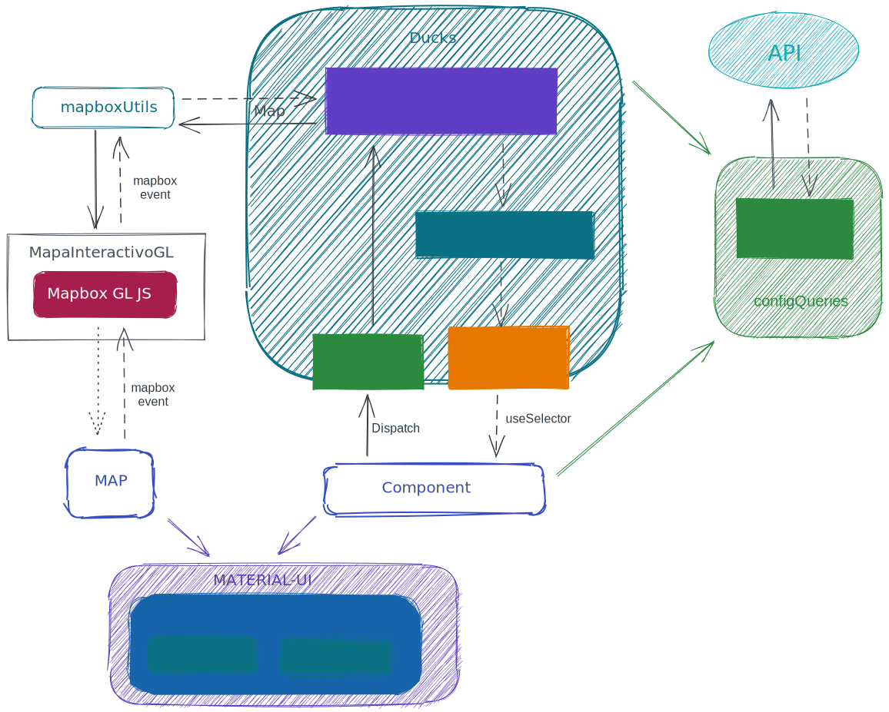

# BA Mapas
### Uso:
En src/appConfig.js se configuran los grupos y las capas que figurarán en el panel lateral y las secciones que se abren al seleccionar cada categoría<br />
Actualmente se utiliza una url que depende del entorno lo sirve un Django local o se sirve desde el nginx de cada servidor.
Se pueden usar capas públicas y ya configuradas que se sirven en epok desde [este endpoint](https://epok.buenosaires.gob.ar/mapainteractivoba/layers/?protocol=https) así como también creando capas usando directamente las funcionalidades de [mapbox gl js](https://docs.mapbox.com/mapbox-gl-js/style-spec/)
 ~~En la carpeta /media/data se encuentran los geojson que se levantan de manera local
En el archivo config.js también se encuentran las imágenes de los puntos,  las referencias de las capas que están de manera local y los links de BAData para cada capa~~ <br />


### Nota del autor:

Este proyecto depende fuertemente de src/utils/MapaInteractivoGL.js que es una clase que intenta reemplazar la librería publicada en npm de [mapainteractivo](https://www.npmjs.com/package/@usig-gcba/mapa-interactivo) pero usando mapbox en lugar de leaflet.
En el futuro probablemente sea conveniente usar directamente [react-map-gl](https://uber.github.io/react-map-gl/) o [deck.gl](https://deck.gl/#/), eso es algo que habría que evaluar.

### Deploy
Esto fue hecho con create-react-app así que abajo está mas o menos todo lo que tienen que saber.

Lo único importante a saber es que si el mapa se va a publicar en una url que no es la base del dominio se tiene que agregar el atributo "homepage" en el package.json ... <br />
ejemplo: <br />
"homepage": "https://usig.buenosaires.gob.ar/mi-mapa"
<br />
Para levantar el django habría que seguir el [instructivo] (https://www.digitalocean.com/community/tutorials/como-configurar-django-con-postgres-nginx-y-gunicorn-en-ubuntu-18-04-es) para instalar Gunicorn para servir DJANGO

## Stack

- Django (backend) 
- React (frontend)

# Instalación (Entorno de desarrollo)

note: GDAL no esta al día de hoy lanzado para ubuntu 20 lts

## Backend:

```json
 sudo apt update
 sudo apt install python3-pip
 sudo apt-get install libsasl2-dev python-dev libldap2-dev libssl-dev
 sudo pip3 install virtualenv
 virtualenv env
 source env/bin/activate
 pip install -r requirements.txt
 python manage.py migrate
 python manage.py createsuperuser
 sudo add-apt-repository ppa:ubuntugis/ppa && sudo apt-get update
 sudo apt-get install gdal-bin
```
### Instalar Redis como Backend de Cache en Django
1. Instalación y configuración de Redis
Para acceder a la versión más reciente de Redis, utilizaremos apt para instalarla desde los repositorios oficiales de Ubuntu.
Actualice su caché de paquetes local de apt e instale Redis ingresando lo siguiente:
```
sudo apt update
```
```
sudo apt install redis-server
```
Esto descargará e instalará Redis y sus dependencias. Después de esto, hay un cambio de configuración importante que se debe realizar en el archivo de configuración de Redis, generado automáticamente durante la instalación.
Abra este archivo con su editor de texto preferido:
```
sudo nano /etc/redis/redis.conf
```
Encuentre la directiva supervised dentro del archivo. Esta directiva le permite declarar un sistema init para administrar Redis como un servicio, lo que le proporcionará mayor control sobre su funcionamiento. Por defecto, el valor de la directiva supervised es no. Debido a que se trata de Ubuntu, el cual utiliza el sistema init de systemd, cambie el valor a systemd:
supervised systemd

Reinicie el servicio de Redis para reflejar los cambios realizados en el archivo de configuración:
```
sudo systemctl restart redis.service
```
2. Pruebas en Redis
Comience verificando que el servicio de Redis esté en ejecución:
```
sudo systemctl status redis.service
```
Para comprobar que Redis funcione de forma correcta, establezca conexión con el servidor utilizando el cliente de línea de comandos:
```
redis-cli
```
En la siguiente línea de comandos, realice una prueba de conectividad con el comando ping:
```
ping
```
```
Output
PONG
```
3. Configurar un contraseña de Redis: <br>
Editar configuración:
sudo nano /etc/redis/redis.conf
Editar Linea:
requirepass <micontraseña>
Reiniciar servicio:
```
sudo systemctl status redis.service
```
4. Configurar Redis en Django
Instalar Django-redis
Parados en nuestro entorno virtual ejecutar:
pip install django-redis
En el settings.py
```
CACHE_TTL = 60 * 15  # 15 minutos
CACHES = {
    'default': {
        'BACKEND': 'django_redis.cache.RedisCache',
        'LOCATION': 'redis://127.0.0.1:6379/1',
        'OPTIONS': {
            'CLIENT_CLASS': 'django_redis.client.DefaultClient',
        },
    }
}
```
En la view.py que se desee cachear:

from django.core.cache.backends.base import DEFAULT_TIMEOUT
from django.views.decorators.cache import cache_page

CACHE_TTL = getattr(settings, 'CACHE_TTL', DEFAULT_TIMEOUT)

Sobre el método que se desea cachear colocar el decorador:
@cache_page(CACHE_TTL)


### para levantarlo:

```bash
python manage.py runserver

ir a http://127.0.0.1:8000/admin/
```


---
# Frontend:

Para probarlo simplemente clonar el repositorio y  ejecutar estas dos lineas de código en la consola.
```bash
npm install
npm start
```
Se abre una solapa en [http://localhost:``3000``](http://localhost:3000) el valor ``PORT`` definido en ``.env.development``

Para poder utilizar el captcha que se encuentra en la categoria *Ayudanos a mejorar* 
se debe cambiar localhost por 127.0.0.1 [http://127.0.0.1:``3000``](http://127.0.0.1:3000)

## Desarrollo

### Entorno
Se ha probado utilizando node 12.18.2 (lts/erbium) con npm 6.14.5, específicamente se ha desarrollado sobre windows 10, Linux Ubuntu y macOS Catalina, es de suponer se puede continuar el desarrollo en cualquier sistema operativo que soporte node 12 o superior.

### IDE

Si bien el proyecto debería poder ser utilizado con cualquier IDE, se recomienda fuertemente utilizar VSCode con las siguientes dos extensiones:

* **ESLint**: Resalta en rojo los errores de ESLint, es importante que procuremos mantener un estilo de código unificado. Este estilo esta definido en ``.eslintrc.json``

* **Debugger for Chrome**:  Útil al momento de depurar código, también se recomienda usar log points en reemplazo de ``console.log`` si se desea hacer console.log por favor no deshabilitar el ESLint en esa linea, para asegurar que se eliminara antes de hacer el commit.

* **Live Share**: Permite un fácil trabajo en equipo, al momento de ver código en el que esta trabajando un compañero.

Otras extensiones útiles:
* **GitLens**: Varias utilidades de git que son más practicas en un entorno visual que por consola, por ejemplo comparar archivos entre versiones o ver el último commit de cada linea de código.
  
* **TODO List**: Cuándo tenemos código que sabemos debemos volver a ver tiempo después. es fácil encontrar los ``// TODO:`` ya que permite tenerlos todos juntos en la barra Explorer.
*  Hay muchísimas otras extensiones que pueden resultar útiles como Prettier, Markdown All in One, vscode-icons, colorize, Spell Right.

### Estructura de la aplicación


* **containers**: Son las páginas, para esta aplicación solo se necesita el container **Home** que sirve de contenedor de los componentes principales **Map**, **SideBar** y **Sections**. El container **Fonts** es solo para usar durante el desarrollo para poder visualizar las fuentes disponibles junto con sus decoradores.

* **components**: Como se dijo en containers hay tres componentes principales que engloban toda la aplicación
  * **Map**: Es un contenedor del mapa generado por mapbox gl js a través de **MapaInteractivoGL**,
  // TODO: el componente **Buscador** que actualmente esta en proceso de migración a su versión 2.1.0
  y el mini-mapa que sirve para cambiar entre modo claro y oscuro

  * **SideBar**: Es un contenedor de **Categories** las cuales se obtienen desde appConfig

  * **Sections**: Cuando una **Category** es seleccionada este componente despliega el 
  **Section** correspondiente. A su vez cada **Section** permite navegar entre los **SubSection**

  * **theme**: Definiciones sobre los estilos a utilizar, procurando mantener dentro de lo posible los lineamientos de [Material Design](https://material.io/), pero tomando como prioridad el [diseño](https://xd.adobe.com/view/2f060d90-f9de-445c-b939-f8f42d763eec-7a55/)

    ``index.js``: Contiene las modificaciones sobre el tema de estilos material-ui por defecto.

    **Wrappers**: están algunos componentes basados en material-ui para que sean utilizados por los componentes y todos mantengan la estetica.

* **state**: Aquí se encuentra el estado de la aplicación siguiendo la [guía de estilos redux](https://redux.js.org/style-guide/style-guide) la estructura interna de carpetas y archivos está basada en el [patrón ducks](https://github.com/erikras/ducks-modular-redux), si algún duck se volviera muy complejo tal vez sea recomendable utilizar el patrón [re-ducks](https://github.com/alexnm/re-ducks).
  
* **utils**: Por supuesto contiene funciones útiles y transversales a las diferentes partes de la aplicación. Entre ellas las más importante son:
  * **MapaInteractivoGL**: Sin lugar a dudas aquí se encuentran partes vitales de la aplicación, desde aquí se puede acceder a mapbox gl js que es el corazón de la aplicación.
  * **mapBoxUtils**: Principalmente funciones que retornan promesas a ser utilizadas por el middleware. Estas promesas suelen hacer uso de **MapaInteractivoGL** y **Mapbox GL JS**
  * **configQueries**: Sirve para desacoplar los componentes de la configuración de la aplicación.
 
* **appConfig.json**: Actualmente es principalmente un json que contiene toda la información necesaria que la aplicación pueda ser fácilmente adaptada. Se recomienda fuertemente que solo acceda a estas configuraciones a través de **configQueries** con el objetivo de mantener desacoplado la configuración de los componentes y así sea algo relativamente sencillo en un futuro migrar para obtener la configuración desde un api y que esta pueda ser almacenada en memoria o en el sessionStorage según sea conveniente. 


### Sobre la librería **Mapbox GL JS** el componente **Map** y las utilidades **mapboxUtils** y **MapaInteractivoGL**

Como se dijo el corazón de la aplicación es **Mapbox GL JS** esta es una excelente librería para el uso de mapas, lamentablemente está librería está orientada a un paradigma de eventos y objetos donde cada uno mantiene su propia fuente de estado. Mientras por otro lado la aplicación se basa en el principio de redux en mantener una única fuente de datos. Para lograr acoplar estos dos tan diferentes estilos de desarrollo se opta por realizar llamadas a promesas desde el middleware que invoquen los eventos ofrecidos y métodos ofrecidos por mapbox y al terminar el middleware actualizara el estado para que los componentes puedan utilizarlo. Esto se realiza se realiza a través de **mapBoxUtils** y **MapaInteractivoGL**. Claramente esto puede ser una muy posible fuente de bugs, por eso se analizaron las alternativas [react-mapbox-gl](https://github.com/alex3165/react-mapbox-gl) y [react-map-gl](https://github.com/visgl/react-map-gl) ambas ofrecen un wrapper de mapbox gl js, que en principio parecieran permitir una mejor integración entre ambos mundos, pero al entrar en detalle se puede ver que ambas están lejos de ofrece un wrapper del 100% de la funcionalidad de mapbox gl js y si llegáramos a necesitar algún comportamiento especifico, lo cual es altamente probable, la adaptación podría obligarnos a modificar el wrapper directamente, y mencionar que podríamos tener que llegar a resolver bugs internos que pudiera tener el wrapper. Tomando en cuenta esta importante limitación se opta por una integración en la manera antes mencionada a través de llamadas a promesas desde el middleware.


---
## Entorno
Para poder hacer un build de producción es necesario tener creado el .env.prod con la misma estructura que el archivo
.env.development

## Construir frontend (React) y unirlo con Django

### Dev: compilará el código con las variables seteadas en el archivo .env.development
```bash
npm run build:dev
python manage.py collectstatic
```

### Prod: compilará el código con las variables seteadas en el archivo .env.production

### Docker
Para generar la imagen
```bash
docker build -t react-nginx .
```
Para generar el contendor
```bash
docker run -it --name react-nginx -p 8080:80 react-nginx
```
Para inciarlo en luego
```bash
docker start react-nginx
```
